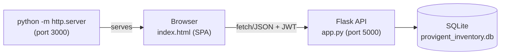

# Provigent Inventory Suite — End-to-End Documentation

This document describes the system as it is actually built and running in this workspace: a Flask REST API backend and a single-page frontend suite (`index.html`) served statically. It supersedes the original scaffolding docs (`README.md`, `QUICK_START.md`, `INSTALLATION_GUIDE.md`, `PROJECT_SUMMARY.md`) which described a React/CRA frontend that is not used in this environment (Node.js is not installed).

## 1. Architecture Overview



- **Backend**: Flask app (`app.py`) exposing a JSON REST API on port `5000`, backed by SQLAlchemy models (`models.py`) and a SQLite database (`provigent_inventory.db`).
- **Frontend**: A single static HTML file, `index.html`, served on port `3000` via Python's built-in HTTP server. It is a vanilla JS SPA (no build step, no Node.js required) that consumes the Flask API directly via `fetch`.
- **Auth**: JWT-based login. Token is stored in `localStorage` and sent as `Authorization: Bearer <token>`.
- **Sales data**: Stored client-side in `localStorage` (key `provigent_sales_records_v1`) since there is no dedicated sales table in the backend. Stock reductions from sales are still posted to the backend via the stock-adjust endpoint, so inventory quantities stay authoritative on the server.

## 2. Tech Stack

| Layer | Technology |
|---|---|
| Backend framework | Flask |
| ORM | Flask-SQLAlchemy |
| Auth | Flask-JWT-Extended |
| Database | SQLite (`provigent_inventory.db`) |
| Password hashing | bcrypt |
| CORS | flask-cors |
| Frontend | Vanilla HTML/CSS/JS (no framework, no build tools) |
| Charts | Inline SVG (hand-rolled line/bar charts) |

## 3. Running the Project

### 3.1 Backend

```powershell
cd "c:\Users\kveld\Downloads\files"
.\venv\Scripts\Activate.ps1
python app.py
```

- Runs on `http://127.0.0.1:5000`
- On first run, `create_app()` calls `db.create_all()` and `seed_default_data()`, which:
  - Creates baseline categories, an admin user, and suppliers if none exist.
  - Seeds inventory up to 150 auto-generated items (deterministic naming, randomized quantity/cost) if fewer than 150 exist, all with `location = "Chennai"`.

### 3.2 Frontend

```powershell
cd "c:\Users\kveld\Downloads\files"
.\venv\Scripts\python.exe -m http.server 3000
```

- Open `http://localhost:3000/` — this serves `index.html`, the main SPA.
- `dashboard.html` and `frontend.html` are earlier prototype pages kept in the workspace; `index.html` is the current, complete suite.

### 3.3 Default Login

| Field | Value |
|---|---|
| Username | `admin` |
| Password | `admin123` |

## 4. Backend API Reference

Base URL: `http://127.0.0.1:5000/api`. All routes except `/`, `/api`, `/api/auth/login`, `/api/auth/register` require `Authorization: Bearer <token>`.

| Method | Path | Purpose |
|---|---|---|
| GET | `/` | Root health check |
| GET | `/api` | API root, lists key endpoints |
| POST | `/api/auth/login` | Login, returns `access_token` + `user` |
| POST | `/api/auth/register` | Create a new user |
| GET | `/api/inventory` | List items (pagination, search, category, status filters) |
| GET | `/api/inventory/<id>` | Get one item |
| POST | `/api/inventory` | Create item (defaults: `unit=piece`, `location=Chennai`) |
| PUT | `/api/inventory/<id>` | Update item fields |
| DELETE | `/api/inventory/<id>` | Delete item |
| GET | `/api/dashboard/stats` | Totals: item count, inventory value, low-stock count, pending orders, alert counts |
| GET | `/api/dashboard/alerts` | Active (unresolved) alerts |
| GET | `/api/dashboard/low-stock` | Items at/under `min_quantity` |
| GET | `/api/dashboard/recent-orders` | Last 10 orders |
| GET | `/api/suppliers` | List suppliers (paginated) |
| POST | `/api/suppliers` | Create supplier |
| GET | `/api/orders` | List purchase orders (paginated, filter by status) |
| POST | `/api/orders` | Create purchase order with line items |
| PUT | `/api/orders/<id>` | Update order status |
| POST | `/api/stock/adjust` | Apply a signed quantity delta to an item, logs `StockHistory` + `StockAdjustment` |

Item `status` is computed, not stored: `critical` if qty ≤ `min_quantity` (or 0), `warning` if qty is in the lower 30% of the `min`–`max` band, else `good`.

## 5. Database Schema (`models.py`)

| Model | Key fields | Notes |
|---|---|---|
| `User` | username, email, password (bcrypt), role, is_active | Auth principal |
| `Supplier` | name, contact info, lead_time_days, rating | Linked to items/orders |
| `Category` | name, description | Linked to items |
| `InventoryItem` | sku, barcode, unit, current/min/max/reorder quantity, unit_cost, location, supplier_id, category_id | `status` and `to_dict()` computed properties |
| `StockHistory` | item_id, previous/new quantity, transaction_type, quantity_change | Audit trail for every stock change |
| `Order` / `OrderItem` | order_number, supplier_id, status, total_amount | Purchase orders |
| `Alert` | severity, is_resolved | Surfaced on dashboard |
| `StockAdjustment` | item_id, adjustment_quantity, reason | Created by `/api/stock/adjust` |
| `AuditLog` | generic audit table (not actively populated by current routes) |

## 6. Frontend Suite (`index.html`)

Single-page app with a login gate and a sidebar-navigated workspace. All data after login is fetched live from the Flask API (except sales records, which are local-only).

### 6.1 Login Page
- Pre-filled demo credentials (`admin` / `admin123`).
- Calls `POST /api/auth/login`, stores JWT in `localStorage`, then reveals the app shell.
- Session is restored automatically on reload if a token is already stored.

### 6.2 Dashboard
- KPI cards: total items, low-stock alerts, inventory value, total sales value (from local sales records).
- Low-stock trend line chart (SVG).
- Stock value by category bar chart with legend.

### 6.3 Inventory Management
- Searchable/filterable/paginated table (search by name/SKU, filter by status, page size 10/15/25/50, Prev/Next, page indicator).
- Selecting a row loads it into an edit form supporting:
  - **Update item** (`PUT /api/inventory/<id>`)
  - **Adjust stock** (`POST /api/stock/adjust`, signed quantity + reason)
  - **Delete item** (`DELETE /api/inventory/<id>`)

### 6.4 Stock List
- Read-focused view of stock availability and quantity.
- Search by name/SKU, availability filter (all/available/out of stock), sort by name or quantity.
- Summary line: items shown, available count, total quantity.

### 6.5 Alerts
- Lists all items with `current_quantity < 25`, sorted ascending by quantity.
- Summary: total low-stock alerts and out-of-stock count.

### 6.6 New Stock Creation
- Dedicated form to create a new item (`POST /api/inventory`), separate from the inventory management table.

### 6.7 Sales
- Select an existing item, enter quantity/unit price/customer/reference, and record a sale.
- On submit: posts a negative adjustment to `/api/stock/adjust` (reason `sale`) to decrement backend stock, then appends a record to the local sales log (`localStorage`).
- Recent sales table shows the last 10 transactions.

### 6.8 Sales Report
- Date range filter (from/to) over the local sales log.
- KPIs: transactions, units sold, sales value, average ticket.
- Charts: daily sales value trend (line) and top sold items by quantity (bar).
- Full filtered sales table.

## 7. Data Notes & Known Limitations

- **Sales persistence**: Sales transactions are stored only in the browser's `localStorage`, not in the SQLite database. Clearing browser storage or using a different browser/machine loses sales history (inventory quantity changes from sales remain persisted server-side via stock adjustments).
- **Location field**: All existing and newly created inventory items default to `location = "Chennai"` (backend default in `seed_default_data()` and the `create_inventory_item` route).
- **Node.js / React**: The original `frontend/` (React + `package.json`) is not runnable in this environment because Node.js/npm are not installed. `index.html` is the fully functional replacement and requires no build step.
- **Auth**: Demo JWT secret is short (dev-only warning from PyJWT); not intended for production use as-is.

## 8. Suggested Next Steps

1. Add a backend `Sale`/`SaleItem` model and API so sales persist server-side and survive across devices/browsers.
2. Add CSV/PDF export for Stock List and Sales Report pages.
3. Add role-based UI restrictions (admin vs staff) using the existing `role` field on `User`.
4. Replace the dev JWT secret and SQLite with production-grade config before any real deployment.
